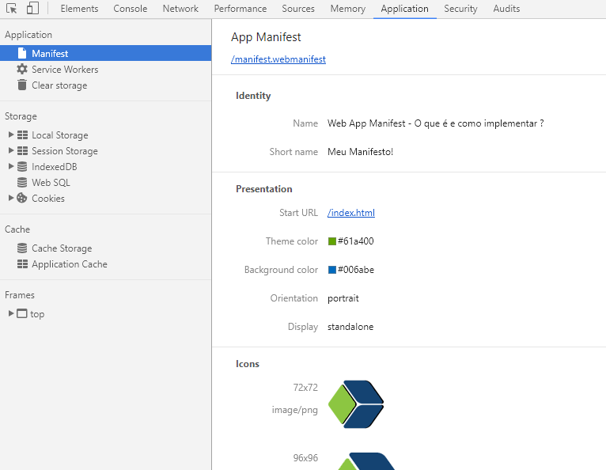

# Aprimorando visualização de web app em dispositivos móveis através do WebManifest.

```bash
Atualmente, a experiência de usuário em dispositivos móveis é um ponto importante que 
desenvolvedores devem ficar atentos, pois quanto melhor a experiência maior o tempo em 
contato com a sua marca, gerando assim excelentes chances de realizar negócios.

Existem diversas estratégias para criar e efetivar engajamento com clientes e usuários 
através de técnicas de UX, neste artigo iremos tratar principalmente como você pode tornar 
seu aplicativo web mais atraente e envolvente de forma simples, em diferentes dispositivos.
Para isto, iremos usufruir de meta tags e das interessantes opções que o manifest.webmanifest 
e seus metadados nos concede. 
 ```


### Publicações
* [Blog CedroTech](http://blog.cedrotech.com/aprimorando-visualizacao-de-web-app-em-dispositivos-moveis-atraves-do-webmanifest/)


### Portfolio

# 
